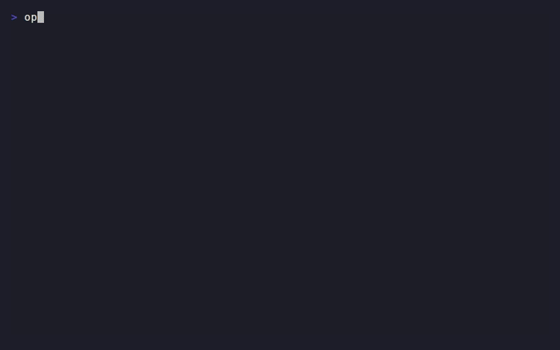

# opencode-selector

> A beautiful, keyboard-driven TUI for browsing and launching [opencode](https://opencode.ai) sessions.

<p align="center">
  
</p>

<p align="center">
  <a href="https://github.com/fzaca/opencode-selector/releases"></a>
  <a href="https://github.com/fzaca/opencode-selector/blob/master/LICENSE"></a>
  
  
  
</p>

## Installation

**Linux x86_64 only.** ARM support coming soon.

```bash
curl -fsSL https://raw.githubusercontent.com/fzaca/opencode-selector/master/scripts/install.sh | bash
```

Installs `opcs` to `/usr/local/bin` or `~/.local/bin`.

### Update

```bash
opcs upgrade
```

Or re-run the install script above.

### From source

```bash
cargo install --path .
```

## Quick start

```bash
opcs                  # sessions for current project
opcs --global         # all sessions across projects
opcs --folders        # enable folder organization
opcs session <id>     # launch session directly
opcs list             # list sessions as JSON
```

## Features

- Fuzzy search, sort, and filter sessions
- Full-screen preview of any conversation
- Folder system (sidecar TOML, safe from opencode updates)
- Vim keys, arrows, and mouse support
- Adaptive terminal colors (reads opencode theme)
- Session rename, archive, and permanent delete
- Project-aware: shows only sessions for your current directory

## Keybindings

| Key | Action |
|-----|--------|
| `↑↓` / `kj` | Navigate list |
| `Enter` | Open session |
| `/` | Search |
| `p` | Preview |
| `n` | New session |
| `r` | Rename |
| `d` / `D` | Archive / Delete |
| `P` | Toggle project filter |
| `F` | Toggle folders |
| `?` | Help |
| `q` / `Esc` | Quit / back |

## Development

```bash
cargo build
cargo test
cargo clippy -- -D warnings
cargo fmt --check
```

See [AGENTS.md](AGENTS.md) for conventions.

## License

MIT © Zacarias
